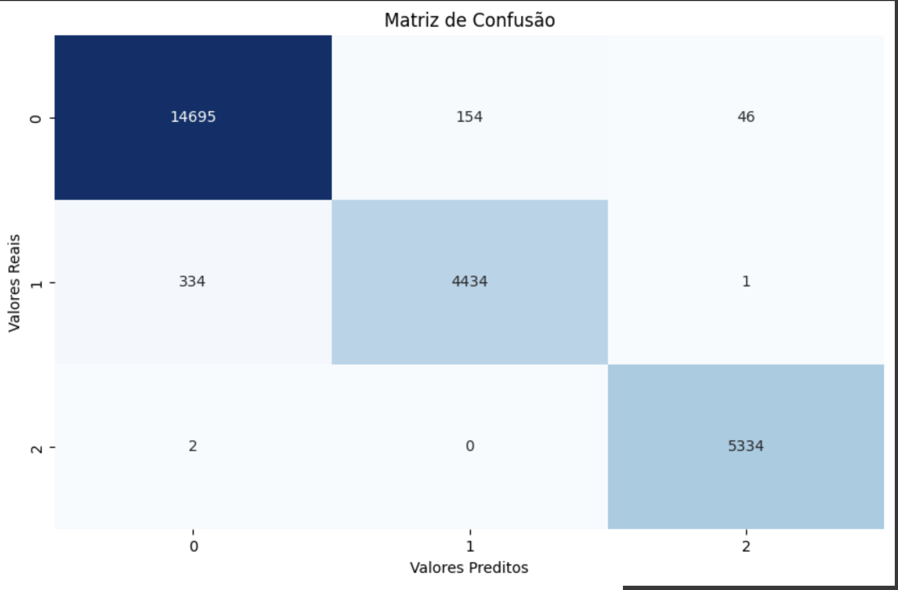

# Analise_dados
🚀 Explorando o Poder da Aprendizado de Máquina com Python e RandomForestClassifier 🌲

Acabei de concluir um projeto empolgante de análise de dados e aprendizado de máquina! 📊🤖 Utilizando o Python, pandas, seaborn e scikit-learn, desenvolvi um modelo de classificação de estrelas com a Random Forest Classifier. Aqui estão alguns destaques do projeto:

🔍 Análise Exploratória de Dados:
Realizei uma análise inicial dos dados, entendendo a estrutura do conjunto de dados e identificando padrões relevantes para o problema.

🤖 Treinamento do Modelo:
Dividi os dados em conjuntos de treinamento e teste, criei um modelo de RandomForestClassifier e o treinei com 50 árvores.

📈 Avaliação de Desempenho:
Utilizei métricas como acurácia, matriz de confusão e relatório de classificação para avaliar o desempenho do modelo no conjunto de teste.

🔥 Visualização Impactante:
Criei visualizações impactantes, incluindo um heatmap da matriz de confusão e curvas de aprendizado, utilizando bibliotecas como seaborn e scikit-plot.

💡 Lições Aprendidas:
Aprendi a importância de uma análise exploratória sólida, a escolha adequada de métricas de avaliação e a importância de visualizar os resultados para uma compreensão mais profunda.

